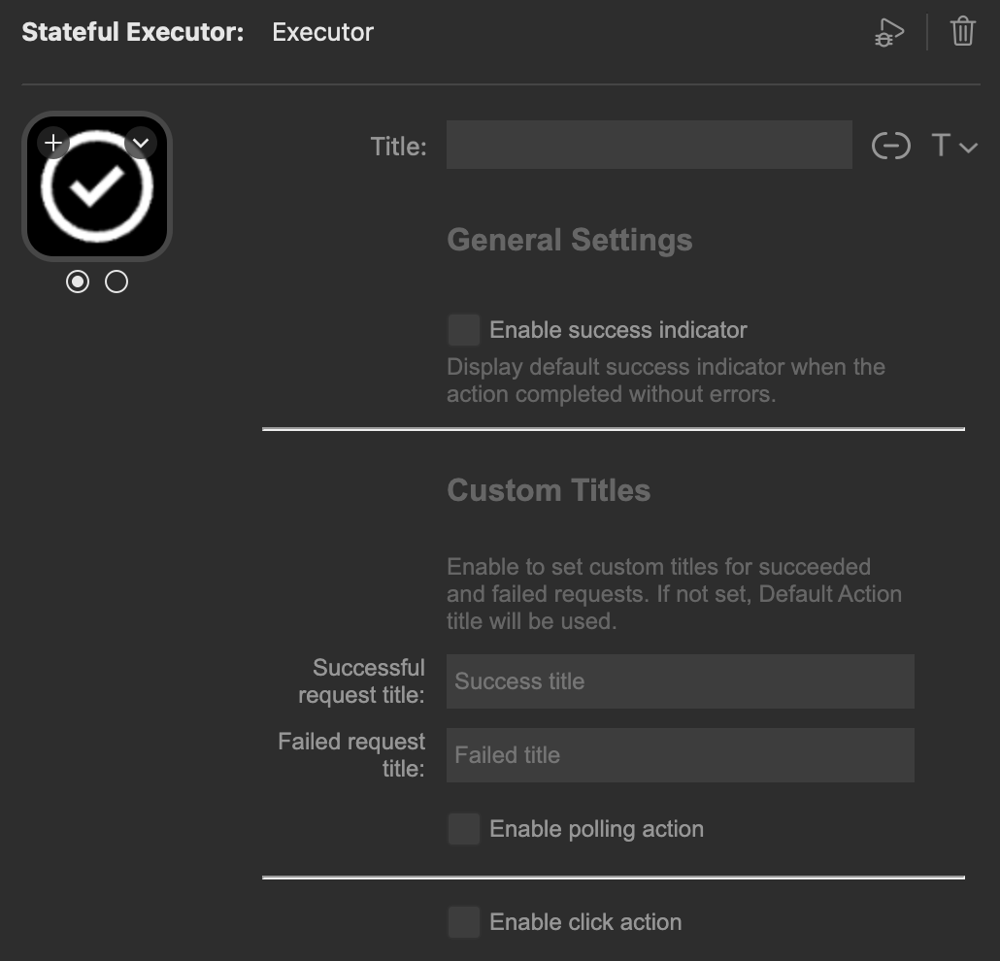
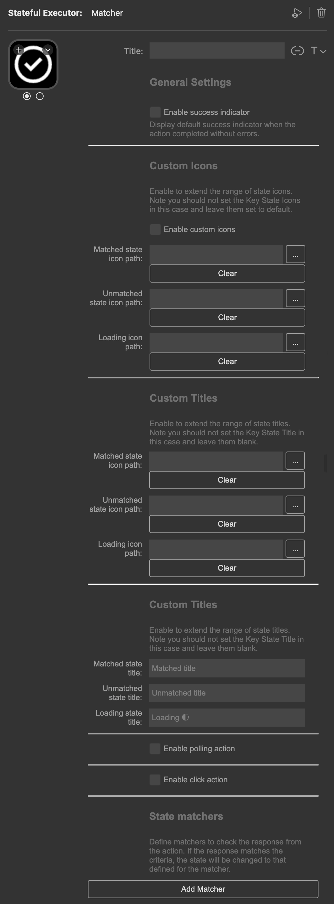
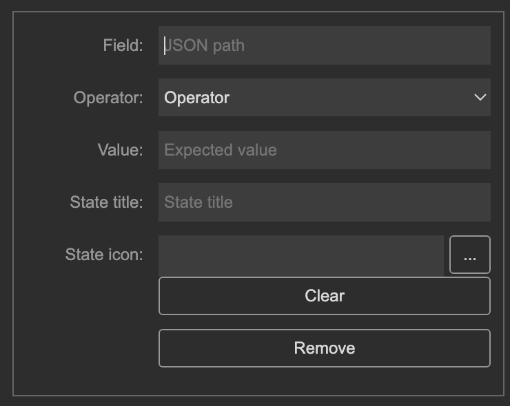
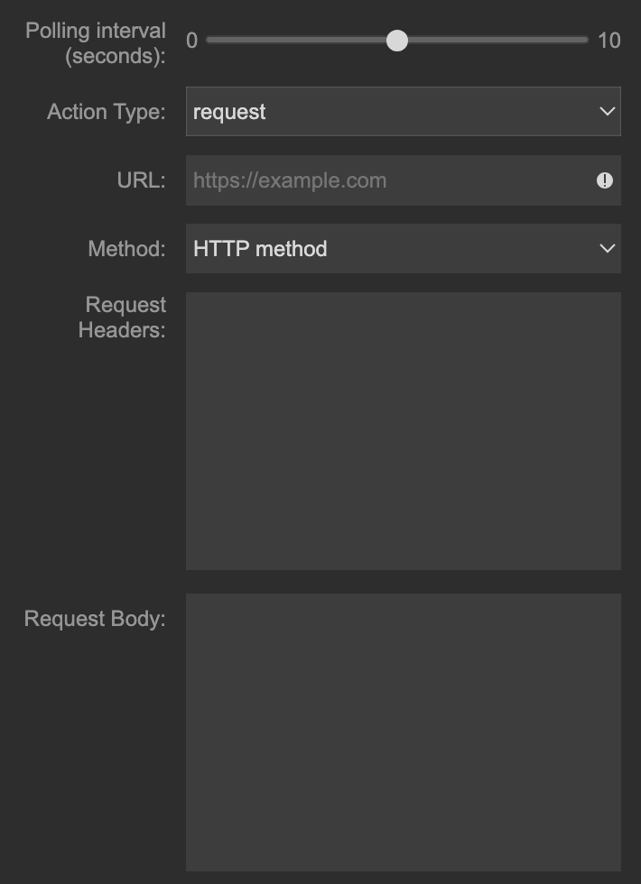

# Stream Deck Stateful Executor

An automation plugin for Stream Deck that executes HTTP requests, Apple Shortcuts, terminal commands, and shell scripts with dynamic button states based on execution results.

## Table of Contents

- [Features](#features)
- [Installation](#installation)
  - [From Elgato Marketplace](#from-elgato-marketplace)
  - [Manual Installation](#manual-installation)
- [Configuration](#configuration)
  - [Executor Action](#executor-action)
  - [Matcher Action](#matcher-action)
    - [Matcher Configuration](#matcher-configuration)
    - [Action Configuration](#action-configuration)
    - [Template Syntax](#template-syntax)
- [Example Configurations](#example-configurations)
  - [Weather Display for Vienna](#weather-display-for-vienna)
  - [Disk Space Monitor](#disk-space-monitor)

## Features

* **Executor Action** - Execute actions on click or by polling, with visual feedback for success/error states
* **Matcher Action** - Execute actions and display different icons based on conditional response matching
* **Template Syntax** - Both actions support [ETA](https://eta.js.org/) templates for dynamic content

## Installation

### From Elgato Marketplace

1. Visit the [Stateful Executor page](https://marketplace.elgato.com/product/stateful-executor-e9612a4f-b8d7-44f8-a5ed-9ad9f9ae3064) on Elgato Marketplace
2. Click "Get" and follow the installation prompts

### Manual Installation

1. Download the latest `.streamDeckPlugin` file from [releases](https://github.com/pandomic/stream-deck-stateful-executor/releases)
2. Double-click the file and follow the installation prompts

## Configuration

> [!NOTE]
> Action responses are first parsed as JSON, then passed as raw strings if JSON parsing fails.

### Executor Action

Execute actions on click or by polling, with visual state indicators.

**Button States:**
- **First icon** - Successful execution
- **Second icon** - Failed execution

**Settings:**
* **Enable success indicator** - Shows a default success indicator on successful executions
* **Successful request title** - Custom title for successful executions
* **Failed request title** - Custom title for failed executions

### Matcher Action

Execute actions and display icons based on conditional response matching. Supports multiple matchers for advanced state visualization.

**Settings:**
* **Enable success indicator** - Shows a success indicator when execution completes without errors (respects matcher conditions)

**Button States (single matcher):**
- **First icon** - Condition matched
- **Second icon** - Condition not matched

**Custom Icons:**

> [!IMPORTANT]
> Custom icons must be in a permanent location since they're referenced by path.

* **Default behavior** - Use Stream Deck's UI to set icons. First icon = matched state, second icon = unmatched state (applies to all matchers, plugin-level customization won't work)
* **Multiple states** - Leave icons/titles blank in Stream Deck's UI and configure them through the plugin's settings

#### Matcher Configuration

> [!TIP]
> * Matchers work with both JSON and non-JSON outputs. For non-JSON outputs, leave the `Field (JSON path)` empty.
> * Matchers are executed top-to-bottom, enabling intervals support.

* **Field** - Dot-notation JSON path to the property (e.g., `status` for `{"status": "ok"}`)
* **Operator** - Comparison operator (varies for strings vs. numbers)
* **Value** - Value to match against
* **State Title** - Custom title when matched
* **State Icon** - Custom icon path when matched

#### Action Configuration

**Triggers:**
* **Click** - Execute on button press
* **Polling** - Execute every N seconds (waits for completion before next execution)
* Both triggers can be combined, with polling taking presentation priority

**Action Types:**

* **request** - Execute HTTP requests (use JSON output for matchers)
* **shortcut** (macOS only) - Execute Apple Shortcuts (use Dictionary output for matchers)
* **terminal** - Execute terminal commands (use JSON-parsable output for matchers)
* **script** - Execute shell scripts (use JSON-parsable output for matchers)
  * **Shell binary** - Shell to use (default: `/bin/bash`). Can use other binaries like Python or Node.js
  * **Script path** - Path to executable script (must have appropriate shebang)

#### Template Syntax

Custom titles support [ETA](https://eta.js.org/) template syntax for dynamic content from action responses.

**Examples:**
- **Required JSON attribute (fails if not present):** `This fact contains {{= length }} characters`
- **Optional JSON attribute (falls back to undefined):** `This fact contains {{= it.length }} characters`
- **Raw non-JSON data:** `The result was {{= it.result }}`

## Example Configurations

### Weather Display for Vienna

Polls Vienna's weather and displays different icons based on temperature.

**Configuration:**
- **Plugin Action:** Matcher
- **Enable Polling Action**
- **Action Type:** Request
- **URL:** `https://api.open-meteo.com/v1/forecast?latitude=48.2082&longitude=16.3738&current=temperature_2m`
- **HTTP Method:** GET

**Matchers:**
1. **Cold** (≤ 0°C)
   - Field: `current.temperature_2m`
   - Operator: `less or equal to`
   - Value: `0`
   - State Title: `Cold`
   - State Icon: Path to cold icon

2. **Warm** (≤ 24°C)
   - Field: `current.temperature_2m`
   - Operator: `less or equal to`
   - Value: `24`
   - State Title: `Warm`
   - State Icon: Path to warm icon

3. **Hot** (> 24°C)
   - Field: `current.temperature_2m`
   - Operator: `greater than`
   - Value: `24`
   - State Title: `Hot`
   - State Icon: Path to hot icon

### Disk Space Monitor

Displays used disk space on the root volume.

**Configuration:**
- **Plugin Action:** Executor
- **Enable Polling Action**
- **Action Type:** Terminal
- **Command:** `df -h / | awk 'NR==2 {print $3}'`
- **Successful Title:** `{{= it.result }}`
